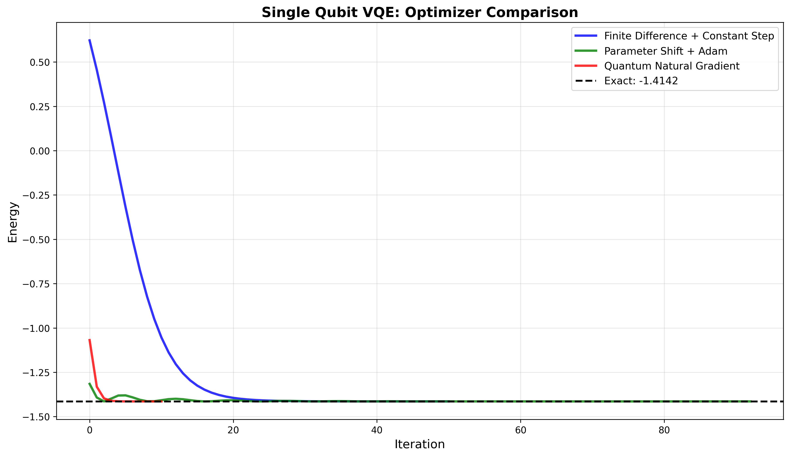
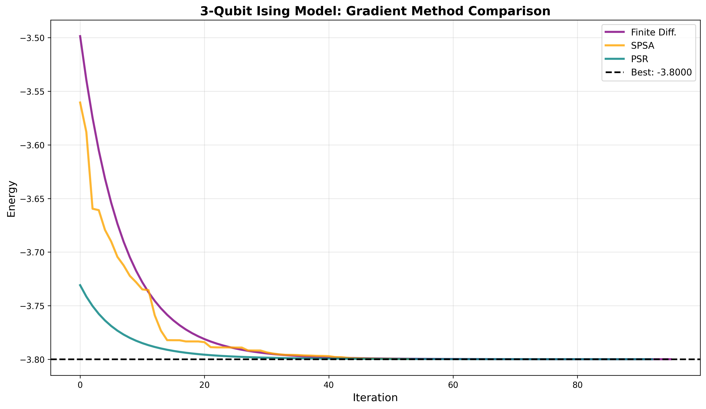
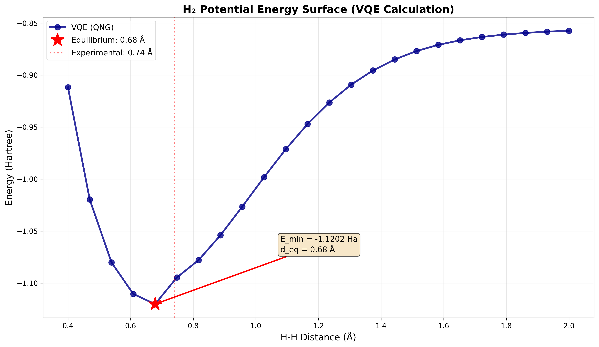

# Variational Quantum Eigensolver (VQE)

A modular, extensible Python framework for implementing Variational Quantum Eigensolver algorithms. Built with a mixin-based architecture that enables flexible composition of quantum systems, ansätze, gradient methods, and optimization strategies for ground state energy calculations.

---

## Demonstrations

<p align="center">
  
  
  
</p>

<p align="center">
  <em>Left: Single qubit system with different optimizers | Center: Ising model gradient method comparison | Right: H₂ potential energy surface</em>
</p>

---

## Table of Contents

- [Overview](#overview)
- [Features](#features)
- [Installation](#installation)
- [Quick Start](#quick-start)
- [Physics Background](#physics-background)
- [API Reference](#api-reference)
- [Project Structure](#project-structure)
- [Performance](#performance)
- [Usage Examples](#usage-examples)
- [License](#license)
- [Acknowledgments](#acknowledgments)

---

## Overview

The Variational Quantum Eigensolver (VQE) is a hybrid quantum-classical algorithm designed to find ground state energies of quantum systems. This implementation provides a flexible, modular framework for:

- **Quantum systems**: Single qubits, Ising models, molecular Hamiltonians (H₂, etc.)
- **Parametrized circuits**: Hardware-efficient ansätze with tunable depth
- **Gradient computation**: Finite differences, parameter shift rule, SPSA
- **Optimization methods**: Gradient descent, Adam, Quantum Natural Gradient (QNG)
- **Step size strategies**: Constant, decaying, and adaptive learning rates

The framework uses a **mixin-based architecture** where components are combined through multiple inheritance, enabling rapid prototyping and experimentation with different VQE configurations.

### Key Features

- **Modular design**: Mix and match system, ansatz, gradient, and optimizer
- **Quantum Natural Gradient**: Advanced optimization leveraging quantum geometry
- **Molecular chemistry**: Built-in support for H2 using PySCF and Jordan-Wigner mapping
- **Extensible**: Easy to add new systems, ansätze, or optimization strategies

---

## Features

### Quantum Systems
- **Single Qubit System**
  - Simple test case: $H = -X - Z$
  - Exact ground state: $E_0 = -\sqrt{2} \approx -1.414$
  - Ideal for algorithm validation
  
- **Ising Model**
  - $n$-qubit transverse field Ising Hamiltonian
  - $H = -\sum_i h_i Z_i - \sum_{i<j} J_{ij} Z_i Z_j$
  - Configurable coupling and external fields
  - Supports nearest-neighbor and arbitrary interactions
  
- **Hydrogen Molecule (H₂)**
  - Electronic structure calculation
  - PySCF driver with STO-3G basis
  - Jordan-Wigner fermionic-to-qubit mapping
  - Hartree-Fock initial state

### Ansätze (Parametrized Quantum Circuits)
- **TrivialAnsatz**: Single-qubit Ry rotations
- **RealAmplitudes**: Hardware-efficient ansatz with real parameters
- **ComplexAnsatz**: EfficientSU2 with complex amplitudes
- Configurable circuit depth via `reps` parameter

### Gradient Methods
- **Finite Differences**: Numerical gradient via forward differences
  - $\frac{\partial E}{\partial \theta_i} \approx \frac{E(\theta + \epsilon e_i) - E(\theta)}{\epsilon}$
  
- **Parameter Shift Rule**: Exact quantum gradients
  - $\frac{\partial E}{\partial \theta_i} = \frac{E(\theta + \pi/2 \, e_i) - E(\theta - \pi/2 \, e_i)}{2}$
  - No approximation error, but requires $2n$ circuit evaluations
  
- **SPSA**: Simultaneous Perturbation Stochastic Approximation
  - Efficient for high dimensions (only 2 evaluations per iteration)
  - Suitable for noisy hardware

### Optimization Strategies
- **Gradient Descent**: Standard first-order optimization
  - $\theta_{k+1} = \theta_k - \eta \nabla E(\theta_k)$
  
- **Adam**: Adaptive moment estimation
  - Combines momentum and RMSProp
  - Adaptive per-parameter learning rates
  
- **Quantum Natural Gradient (QNG)**: Geometrically-aware optimization
  - Uses Fubini-Study metric tensor
  - $\theta_{k+1} = \theta_k - \eta g^{-1} \nabla E(\theta_k)$
  - Faster convergence in curved parameter spaces

### Step Size Strategies
- **ConstantStepSize**: Fixed learning rate $\eta$
- **DecayingStepSize**: $\eta_k = \eta_0 / (1 + \text{decay} \cdot k)$
- **Adam**: Built-in adaptive scheduling

---

## Installation

### Requirements

- Python 3.8+
- NumPy >= 1.20
- SciPy >= 1.7
- Qiskit >= 1.0
- Qiskit Nature >= 0.7
- PySCF >= 2.0 (for molecular calculations)
- Matplotlib >= 3.4 (for visualization)

### Clone Repository

```bash
git clone https://github.com/fynnhufler/Variational-Quantum-Eigensolver.git
cd Variational-Quantum-Eigensolver
```

### Install Dependencies

#### Option 1: Full Installation (Recommended)
Install all dependencies including Jupyter support:

```bash
pip install -r requirements.txt
```

#### Option 2: Manual Installation
Install individual packages:

```bash
pip install numpy scipy matplotlib qiskit qiskit-nature qiskit-algorithms pyscf
```

### Verify Installation

```python
import sys
sys.path.append('src')

from VQE_applications import VQE_OneQubit_PSR_Adam
import numpy as np

# Quick test
vqe = VQE_OneQubit_PSR_Adam(max_iter=10, learning_rate=0.1, reps=1)
theta_init = np.random.uniform(0, 2*np.pi, 4)
theta_opt, E_opt = vqe.run(theta_init)

print("Installation successful!")
print(f"Ground state energy: {E_opt:.6f}")
```

```bash
git clone https://github.com/fynnhufler/Variational-Quantum-Eigensolver.git
cd Variational-Quantum-Eigensolver
```

---

## Quick Start

### Example 1: Single Qubit VQE

```python
import numpy as np
import sys
sys.path.append('src')

from VQE_applications import VQE_OneQubit_PSR_Adam

# Create VQE instance with Parameter Shift + Adam
vqe = VQE_OneQubit_PSR_Adam(
    max_iter=100,
    learning_rate=0.1,
    reps=1,
    store_history=True
)

# Initialize parameters and run
theta_init = np.array([np.pi/4, 0.5, np.pi/3, 0.8])
theta_opt, E_opt = vqe.run(theta_init)

print(f"Ground state energy: {E_opt:.6f}")
print(f"Exact: {-np.sqrt(2):.6f}")
print(f"Error: {abs(E_opt + np.sqrt(2)):.2e}")

# Visualize optimization
vqe.plot_results()
```

### Example 2: Ising Model

```python
from VQE_applications import VQE_Ising_QNG_psr

# Define 4-qubit Ising chain
n_qubits = 4
J = np.zeros((n_qubits, n_qubits))
for i in range(n_qubits - 1):
    J[i, i+1] = 1.0  # Nearest-neighbor coupling

h = 0.5 * np.ones(n_qubits)  # External field

# Create VQE with Quantum Natural Gradient
vqe = VQE_Ising_QNG_psr(
    max_iter=200,
    learning_rate=0.01,
    decay=0.02,
    reps=1,
    J=J,
    h=h,
    store_history=True
)

# Run optimization
n_params = (vqe.reps + 1) * n_qubits
theta_init = np.random.uniform(0, 0.5, n_params)
theta_opt, E_opt = vqe.run(theta_init)

print(f"Ground state energy: {E_opt:.6f}")
```

### Example 3: H₂ Molecule Potential Energy Curve

```python
from VQE_applications import VQE_H2_QNG
import matplotlib.pyplot as plt

# Scan bond distances
distances = np.linspace(0.4, 2.0, 12)
energies = []

for d in distances:
    vqe = VQE_H2_QNG(
        max_iter=100,
        learning_rate=0.05,
        decay=0.02,
        reps=1,
        distance=d,
        store_history=False
    )
    
    n_params = (vqe.reps + 1) * 4  # 4 qubits for H2
    theta_init = np.linspace(0, np.pi, n_params)
    
    _, E = vqe.run(theta_init)
    energies.append(E)
    print(f"d = {d:.2f} Å: E = {E:.6f} Ha")

# Plot potential curve
plt.plot(distances, energies, 'o-')
plt.xlabel('H-H Distance (Å)')
plt.ylabel('Energy (Hartree)')
plt.title('H₂ Potential Energy Surface')
plt.grid(True, alpha=0.3)
plt.show()

# Find equilibrium
eq_idx = np.argmin(energies)
print(f"Equilibrium: {distances[eq_idx]:.2f} Å")
print(f"Ground state: {energies[eq_idx]:.6f} Ha")
```

### Example 4: Custom VQE Design

```python
from base_optimizer import BaseOptimizer
from ansatz import RealAmplitudesAnsatz
from gradients import SPSAGradient
from optimizers import Adam
from systems import IsingModel

# Build custom VQE by mixing components
class MyCustomVQE(
    SPSAGradient,              # Gradient method
    Adam,                      # Optimizer
    RealAmplitudesAnsatz,      # Ansatz
    IsingModel                 # Quantum system
):
    """Custom VQE: SPSA + Adam + RealAmplitudes"""
    pass

# Use it
vqe = MyCustomVQE(
    max_iter=150,
    learning_rate=0.05,
    gradient_eps=0.1,
    reps=2,
    J=J,
    h=h,
    store_history=True
)

theta_init = np.random.uniform(0, 0.5, n_params)
theta_opt, E_opt = vqe.run(theta_init)
```

> **Note**: Check out `VQE_Demo.ipynb` for a comprehensive tutorial with visualizations!

---

## Physics Background

### Variational Quantum Eigensolver

VQE finds the ground state energy of a Hamiltonian $H$ by minimizing:

$$E(\theta) = \langle \psi(\theta) | H | \psi(\theta) \rangle$$

where $|\psi(\theta)\rangle$ is a parametrized quantum state prepared by a quantum circuit (ansatz).

**Algorithm:**
1. Initialize parameters $\theta_0$
2. Prepare state $|\psi(\theta_k)\rangle$ on quantum computer
3. Measure expectation value $E(\theta_k) = \langle H \rangle$
4. Compute gradient $\nabla E(\theta_k)$ (classically or via quantum circuits)
5. Update parameters: $\theta_{k+1} = \theta_k - \eta \nabla E(\theta_k)$
6. Repeat until convergence

### Quantum Natural Gradient

The Quantum Natural Gradient (QNG) uses the Fubini-Study metric to account for the geometry of quantum state space:

$$\theta_{k+1} = \theta_k - \eta g^{-1}(\theta_k) \nabla E(\theta_k)$$

where $g_{ij}(\theta) = \text{Re}\langle \partial_i \psi | \partial_j \psi \rangle$ is the **quantum Fisher information matrix**.

**Benefits:**
- Faster convergence than standard gradient descent
- Natural measure of parameter space distance
- Invariant under reparametrization

**Implementation:**
$$g_{ij} = \text{Re}\left(\langle \partial_{\theta_i}\psi | \partial_{\theta_j}\psi \rangle - \langle \partial_{\theta_i}\psi | \psi \rangle \langle \psi | \partial_{\theta_j}\psi \rangle\right)$$


### Parameter Shift Rule

For quantum circuits with generators having eigenvalues $\pm r/2$:

$$\frac{\partial}{\partial \theta_i} \langle H \rangle = \frac{r}{2}\left[\langle H \rangle_{\theta_i + \pi/(2r)} - \langle H \rangle_{\theta_i - \pi/(2r)}\right]$$

For standard rotation gates ($r=2$):

$$\frac{\partial E}{\partial \theta_i} = \frac{E(\theta + \frac{\pi}{2}e_i) - E(\theta - \frac{\pi}{2}e_i)}{2}$$

**Advantages:**
- Hardware-implementable
- Works on real quantum devices

### SPSA (Simultaneous Perturbation Stochastic Approximation)

Approximates the gradient using only 2 function evaluations:

$$g_k = \frac{E(\theta_k + c_k \Delta_k) - E(\theta_k - c_k \Delta_k)}{2c_k} \Delta_k$$

where $\Delta_k$ is a random perturbation vector (typically $\pm 1$ in each component).

**Advantages:**
- $O(1)$ evaluations per iteration (vs. $O(n)$ for finite differences)
- Noise-resistant
- Practical for high-dimensional problems

**Caution:** Stochastic gradients can cause premature convergence. Use small `eps_energy` (e.g., `1e-8`) or disable early stopping.

---


## API Reference

### Base Classes

#### `BaseOptimizer(max_iter=100, eps_energy=1e-6, store_history=True, random_state=None)`

Abstract base class for all VQE optimizers.

**Parameters:**
- `max_iter` (int): Maximum optimization iterations
- `eps_energy` (float): Energy convergence threshold
- `store_history` (bool): Whether to store optimization trajectory
- `random_state` (int): Random seed for reproducibility

**Methods:**

##### `run(initial_params) -> (theta_opt, E_opt)`

Execute the optimization.

**Parameters:**
- `initial_params` (np.ndarray): Initial parameter values

**Returns:**
- `theta_opt` (np.ndarray): Optimized parameters
- `E_opt` (float): Final ground state energy

##### `compute_gradient() -> np.ndarray`

Compute gradient. Must be implemented by gradient mixin.

##### `compute_expectation_value(state, operator) -> float`

Compute $\langle \psi | H | \psi \rangle$.

##### `get_state(params) -> Statevector`

Get quantum state for given parameters.

##### `plot_results()`

Visualize optimization history.

**Attributes:**
- `params` (np.ndarray): Current parameters
- `state` (Statevector): Current quantum state
- `history_energy` (list): Energy trajectory
- `history_params` (list): Parameter trajectory
- `history_state` (list): State trajectory

### Quantum Systems

#### `OneQubitSystem(**kwargs)`

Single qubit with $H = -X - Z$.

**Attributes:**
- `dim` (int): Number of qubits (1)
- `hamilton` (Operator): Hamiltonian operator
- `initial_state` (Statevector): Initial state $|0\rangle$

**Ground state:** $E_0 = -\sqrt{2} \approx -1.414$

#### `IsingModel(J, h, **kwargs)`

Transverse field Ising model.

**Parameters:**
- `J` (np.ndarray): Coupling matrix ($n \times n$)
- `h` (np.ndarray): External field (length $n$)

**Hamiltonian:**
$$H = -\sum_i h_i Z_i - \sum_{i<j} J_{ij} Z_i Z_j$$

**Attributes:**
- `dim` (int): Number of qubits
- `hamilton` (Operator): Ising Hamiltonian
- `initial_state` (Statevector): $|0\rangle^{\otimes n}$

#### `HydrogenMolecule(distance, **kwargs)`

H2 molecule electronic structure.

**Parameters:**
- `distance` (float): H-H bond distance in Ångströms

**Attributes:**
- `dim` (int): Number of qubits (4 for STO-3G)
- `hamilton` (Operator): Electronic + nuclear repulsion Hamiltonian
- `initial_state` (Statevector): Hartree-Fock state
- `mapper` (JordanWignerMapper): Fermionic-to-qubit mapping

**Details:**
- Basis: STO-3G
- Mapping: Jordan-Wigner
- Energy includes nuclear repulsion

### Ansätze

#### `TrivialAnsatz`

Single-qubit rotation ansatz: $U = \bigotimes_i R_y(\theta_i)$.

**Circuit depth:** 1  
**Parameters per qubit:** 1

#### `RealAmplitudesAnsatz(reps=1, **kwargs)`

Hardware-efficient ansatz with real parameters.

**Parameters:**
- `reps` (int): Number of ansatz repetitions (circuit depth)

**Circuit:**
- Rotation layers: $R_y$ gates
- Entangling layers: Full connectivity with CNOT gates

**Parameters:** $(reps + 1) \times n_{qubits}$

#### `ComplexAnsatz(reps=1, **kwargs)`

EfficientSU2 ansatz with complex amplitudes.

**Parameters:**
- `reps` (int): Number of repetitions

**Circuit:**
- Rotation layers: $R_y$ and $R_z$ gates
- Entangling layers: Full connectivity

**Parameters:** $2 \times (reps + 1) \times n_{qubits}$

### Gradient Methods

#### `FiniteDifferenceGradient(gradient_eps=1e-6, **kwargs)`

Numerical gradient via forward finite differences.

**Formula:**
$$\frac{\partial E}{\partial \theta_i} \approx \frac{E(\theta + \epsilon e_i) - E(\theta)}{\epsilon}$$

**Parameters:**
- `gradient_eps` (float): Step size $\epsilon$

**Cost:** $n+1$ circuit evaluations

#### `ParameterShiftGradient(shifts=None, **kwargs)`

Exact gradient using parameter shift rule.

**Formula:**
$$\frac{\partial E}{\partial \theta_i} = \frac{E(\theta + \frac{\pi}{2}e_i) - E(\theta - \frac{\pi}{2}e_i)}{2}$$

**Parameters:**
- `shifts` (list): Shift values [default: $[\pi/2]$]

**Cost:** $2n$ circuit evaluations  
**Advantage:** Exact (no approximation error)

#### `SPSAGradient(gradient_eps=1e-6, **kwargs)`

SPSA stochastic gradient approximation.

**Formula:**
$$g \approx \frac{E(\theta + \epsilon \Delta) - E(\theta - \epsilon \Delta)}{2\epsilon} \Delta$$

**Parameters:**
- `gradient_eps` (float): Perturbation magnitude $\epsilon$

**Cost:** $2$ circuit evaluations  
**Note:** Set small `eps_energy` (e.g., `1e-8`) to prevent premature convergence

### Optimization Strategies

#### `GradientDescent(**kwargs)`

Standard gradient descent update.

**Update rule:**
$$\theta_{k+1} = \theta_k - \eta \nabla E(\theta_k)$$

Requires a step size strategy mixin (e.g., `ConstantStepSize`).

#### `QuantumNaturalGradient(qng_eps=1e-6, **kwargs)`

Quantum natural gradient with Fubini-Study metric.

**Update rule:**
$$\theta_{k+1} = \theta_k - \eta g^{-1} \nabla E(\theta_k)$$

**Parameters:**
- `qng_eps` (float): Finite difference step for computing metric tensor

**Details:**
- Computes quantum Fisher information matrix
- Uses Moore-Penrose pseudoinverse for numerical stability
- Requires a step size strategy

#### `Adam(learning_rate=0.01, beta1=0.9, beta2=0.999, eps=1e-8, **kwargs)`

Adam optimizer with adaptive learning rates.

**Parameters:**
- `learning_rate` (float): Base learning rate $\eta$
- `beta1` (float): First moment decay
- `beta2` (float): Second moment decay
- `eps` (float): Numerical stability constant

**Update rule:**
$$m_t = \beta_1 m_{t-1} + (1-\beta_1) g_t$$
$$v_t = \beta_2 v_{t-1} + (1-\beta_2) g_t^2$$
$$\theta_{t+1} = \theta_t - \eta \frac{\hat{m}_t}{\sqrt{\hat{v}_t} + \epsilon}$$

### Step Size Strategies

#### `ConstantStepSize(learning_rate=0.01, **kwargs)`

Fixed learning rate.

**Learning rate:** $\eta_k = \eta_0$ for all $k$

#### `DecayingStepSize(learning_rate=0.1, decay=0.01, **kwargs)`

Inverse time decay.

**Learning rate:** $\eta_k = \frac{\eta_0}{1 + \text{decay} \cdot k}$

**Parameters:**
- `learning_rate` (float): Initial learning rate $\eta_0$
- `decay` (float): Decay rate

---

## Project Structure

```
Variational-Quantum-Eigensolver/
├── README.md                          # This file
├── LICENSE                            # MIT License
├── requirements.txt                   # Full dependencies (with Jupyter)
├── VQE_Demo.ipynb                     # Comprehensive tutorial notebook
├── results/                           # Simulation outputs
│   └── demo/                          # Demo notebook results
│       ├── single_qubit_comparison.png
│       ├── ising_gradient_comparison.png
│       └── h2_potential_curve.png
└── src/                               # Source code
    ├── base_optimizer.py              # Core BaseOptimizer class
    ├── ansatz.py                      # Ansatz classes
    ├── gradients.py                   # Gradient computation methods
    ├── optimizers.py                  # Optimization strategies
    ├── systems.py                     # Quantum system Hamiltonians
    └── VQE_applications.py            # Pre-configured VQE classes
```

### Module Descriptions

**`base_optimizer.py`**
- Defines `BaseOptimizer` abstract base class
- Implements optimization loop and convergence checking
- Handles history storage and visualization

**`ansatz.py`**
- `TrivialAnsatz`: Simple single-qubit rotations
- `RealAmplitudesAnsatz`: Hardware-efficient real ansatz
- `ComplexAnsatz`: EfficientSU2 with complex parameters

**`gradients.py`**
- `FiniteDifferenceGradient`: Numerical gradients
- `ParameterShiftGradient`: Exact quantum gradients
- `SPSAGradient`: Stochastic approximation

**`optimizers.py`**
- `GradientDescent`: Standard first-order method
- `QuantumNaturalGradient`: Geometrically-aware optimization
- `Adam`: Adaptive moment estimation
- Step size strategies: `ConstantStepSize`, `DecayingStepSize`

**`systems.py`**
- `OneQubitSystem`: Single qubit test case
- `IsingModel`: Transverse field Ising model
- `HydrogenMolecule`: H2 molecular Hamiltonian

**`VQE_applications.py`**
- Pre-configured VQE classes combining different components
- Examples: `VQE_OneQubit_PSR_Adam`, `VQE_Ising_QNG_psr`, `VQE_H2_QNG`

---

## Performance

### Computational Complexity

| Component | Cost per Iteration | Notes |
|-----------|-------------------|-------|
| **Finite Differences** | $(n+1)$ circuits | $n$ = number of parameters |
| **Parameter Shift** | $2n$ circuits | Exact gradients |
| **SPSA** | $2$ circuits | Most efficient |
| **QNG** | $2n + n^2$ ops | Additional metric computation |
| **Adam** | $O(n)$ ops | Minimal overhead |

### Optimization Tips

1. **Use SPSA for high dimensions**: Reduces cost from $O(n)$ to $O(1)$ circuits per iteration
2. **Start with coarse optimization**: Use fewer `reps`, then increase for final refinement
3. **Warm start**: Initialize from Hartree-Fock or classical solution when available
4. **Adaptive tolerances**: Use larger `eps_energy` (e.g., `1e-4`) for initial exploration
5. **Disable early stopping for SPSA**: Set `eps_energy=1e-8` or `0` to prevent premature convergence

### Memory Usage

- **History storage**: ~$O(n \times k)$ where $k$ is iterations
- **QNG**: Additional $O(n^2)$ for metric tensor
- **Disable history**: Set `store_history=False` for long runs

---

## Usage Examples

### Comparing Gradient Methods

```python
from VQE_applications import (
    VQE_Ising_QNG_finit,  # Finite differences
    VQE_Ising_QNG_psr,    # Parameter shift
    VQE_Ising_QNG_spsa    # SPSA
)

# Setup Ising model
n_qubits = 4
J = np.zeros((n_qubits, n_qubits))
J[0,1] = J[1,2] = J[2,3] = 1.0
h = 0.5 * np.ones(n_qubits)

gradient_methods = {
    'Finite Diff': VQE_Ising_QNG_finit,
    'PSR': VQE_Ising_QNG_psr,
    'SPSA': VQE_Ising_QNG_spsa
}

results = {}
for name, VQE_class in gradient_methods.items():
    vqe = VQE_class(
        max_iter=200,
        learning_rate=0.01,
        reps=1,
        J=J, h=h,
        store_history=True
    )
    
    theta_init = np.random.uniform(0, 0.5, 8)
    theta_opt, E_opt = vqe.run(theta_init)
    
    results[name] = {
        'energy': E_opt,
        'history': vqe.history_energy
    }

# Plot comparison
import matplotlib.pyplot as plt

fig, ax = plt.subplots(figsize=(10, 6))
for name, data in results.items():
    ax.plot(data['history'], label=name, linewidth=2)

ax.set_xlabel('Iteration')
ax.set_ylabel('Energy')
ax.legend()
ax.grid(True, alpha=0.3)
plt.show()
```

### Energy Landscape Visualization

```python
import numpy as np
import matplotlib.pyplot as plt
from VQE_applications import VQE_OneQubit_PSR_Adam

vqe = VQE_OneQubit_PSR_Adam(max_iter=1, store_history=False)

# Scan parameter space
theta_range = np.linspace(0, 2*np.pi, 100)
energies = []

for theta in theta_range:
    vqe.params = np.array([theta])
    vqe.state = vqe.get_state(vqe.params)
    E = vqe.compute_expectation_value(vqe.state, vqe.hamilton)
    energies.append(E)

# Plot landscape
plt.figure(figsize=(10, 6))
plt.plot(theta_range, energies, linewidth=2.5)
plt.axhline(y=-np.sqrt(2), color='r', linestyle='--', 
            label=f'Ground state: {-np.sqrt(2):.4f}')
plt.xlabel('Parameter θ', fontsize=12)
plt.ylabel('Energy E(θ)', fontsize=12)
plt.title('Single Qubit Energy Landscape', fontsize=14, fontweight='bold')
plt.legend()
plt.grid(True, alpha=0.3)
plt.show()
```

### Convergence Study

```python
import numpy as np
from VQE_applications import VQE_Ising_PSR_const

# Study convergence from different initial conditions
n_trials = 20
n_qubits = 3

J = np.zeros((n_qubits, n_qubits))
J[0,1] = J[1,2] = 1.0
h = 0.5 * np.ones(n_qubits)

final_energies = []
iterations_to_converge = []

for trial in range(n_trials):
    vqe = VQE_Ising_PSR_const(
        max_iter=200,
        learning_rate=0.05,
        reps=1,
        J=J, h=h,
        store_history=True
    )
    
    # Random initialization
    theta_init = np.random.uniform(0, 2*np.pi, 6)
    theta_opt, E_opt = vqe.run(theta_init)
    
    final_energies.append(E_opt)
    iterations_to_converge.append(len(vqe.history_energy))

print(f"Mean final energy: {np.mean(final_energies):.6f}")
print(f"Std deviation: {np.std(final_energies):.6f}")
print(f"Mean iterations: {np.mean(iterations_to_converge):.1f}")
```

### Validation

Current validation includes:
1. **Single qubit**: Converges to exact $E_0 = -\sqrt{2}$ within $10^{-6}$
2. **Ising model**: Qualitatively correct ground states
3. **H₂ potential curve**: Correct shape and equilibrium distance
4. **Conservation**: Energy converges monotonically (for deterministic methods)
5. **Gradient checks**: Finite difference vs. parameter shift agreement

---

## License

This project is licensed under the MIT License - see the [LICENSE](LICENSE) file for details.

---

### References

**VQE Algorithm:**
- Peruzzo, A., et al. (2014). "A variational eigenvalue solver on a photonic quantum processor." *Nature Communications*, 5, 4213.

**Quantum Natural Gradient:**
- Stokes, J., et al. (2020). "Quantum Natural Gradient." *Quantum*, 4, 269.
- Yamamoto, N. (2019). "On the natural gradient for variational quantum eigensolver." arXiv:1909.05074.

**Parameter Shift Rule:**
- Mitarai, K., et al. (2018). "Quantum circuit learning." *Physical Review A*, 98(3), 032309.
- Schuld, M., et al. (2019). "Evaluating analytic gradients on quantum hardware." *Physical Review A*, 99(3), 032331.

**SPSA:**
- Spall, J. C. (1992). "Multivariate stochastic approximation using a simultaneous perturbation gradient approximation." *IEEE Transactions on Automatic Control*, 37(3), 332-341.

### Software

- **Qiskit**: Quantum computing framework (IBM Research)
- **Qiskit Nature**: Quantum chemistry applications
- **PySCF**: Python-based quantum chemistry library
- **NumPy** and **SciPy**: Numerical computing

---

## Contact

**Authors**:
- **Simeon Bentke** - [@SimeonBentke](https://github.com/SimeonBentke)
- **Fynn Hufler** - [@fynnhufler](https://github.com/fynnhufler)
- **Melissa Balles** - [@melissaballes2003](https://github.com/melissaballes2003)

**Course**: PHY 381C Computational Physics, UT Austin
**Date**: December 2025

---

## Citation

If you use this code in your research, please cite:

```bibtex
@software{bentke2024vqe,
  author = {Bentke, Simeon and Hufler, Fynn and Balles, Melissa},
  title = {Modular Variational Quantum Eigensolver Framework},
  year = {2025},
  url = {https://github.com/fynnhufler/Variational-Quantum-Eigensolver},
  note = {Computational Physics Final Project, UT Austin}
}
```

---

<!-- ## Notes & References:
  - [Quantum Natural Gradient](https://arxiv.org/abs/1909.02108)
  - [A variational eigenvalue solver on a quantum processor](https://arxiv.org/abs/1304.3061)
  - [An Overview of Variational Quantum Algorithms](https://www.youtube.com/watch?v=SU4FG2eT1rI&t=72s)
  - [Qiskit Summer School 2021 on VQE's](https://github.com/Qiskit/platypus/blob/main/notebooks/summer-school/2021/resources/lab-notebooks/lab-2.ipynb)
  - [A Comparative Analysis on of Classical and Quantum Optimization Methods](https://arxiv.org/abs/2412.19176)
  - [Pure Quantum Gradient Descent Algorithm](https://arxiv.org/abs/1607.06473) -->

